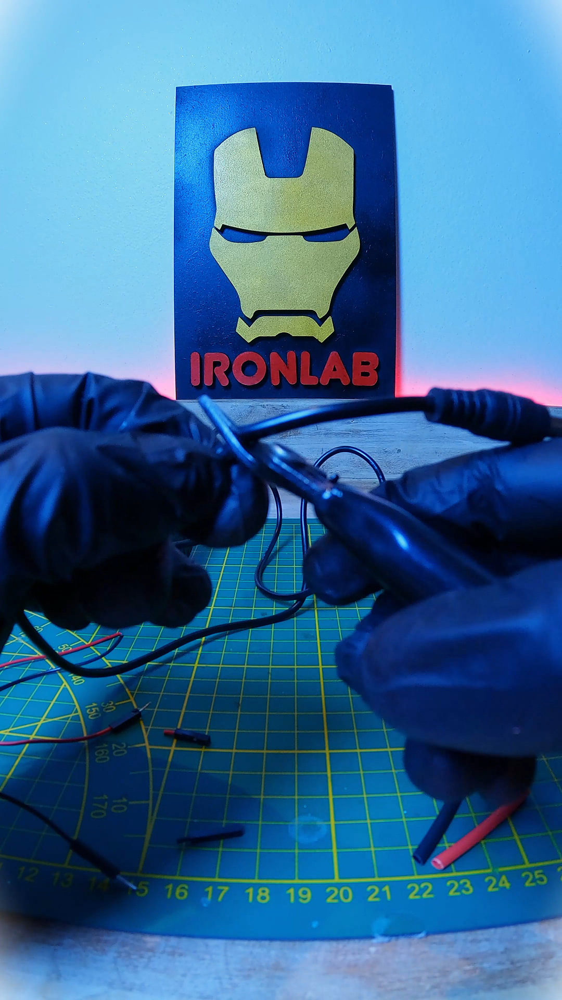
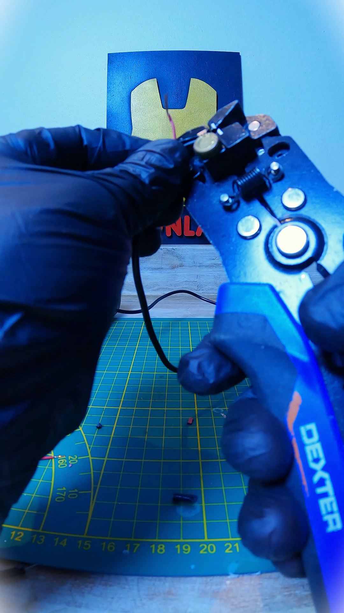
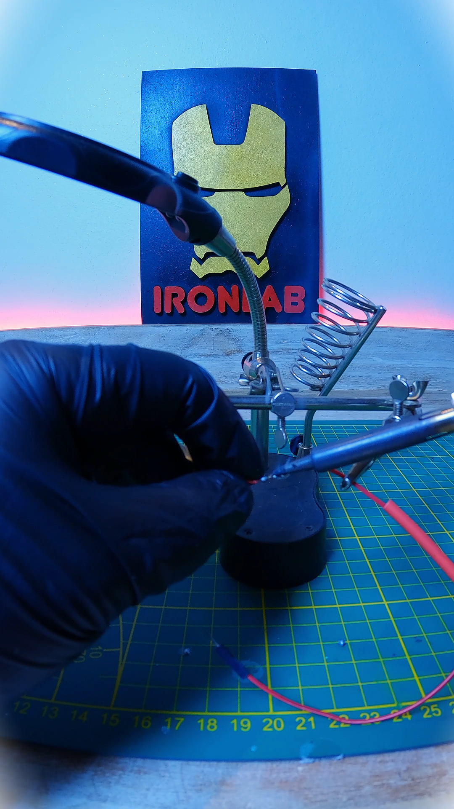
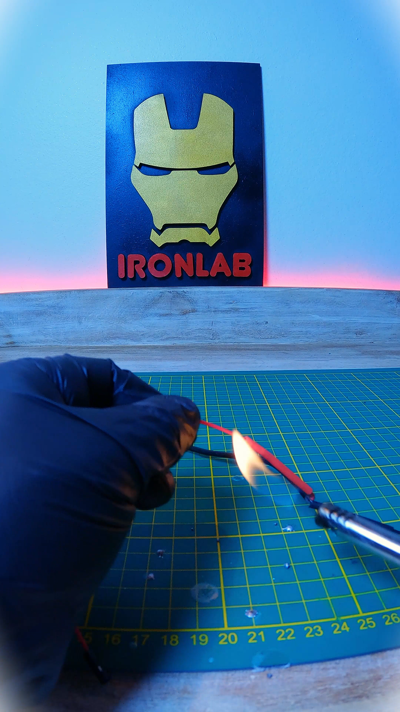
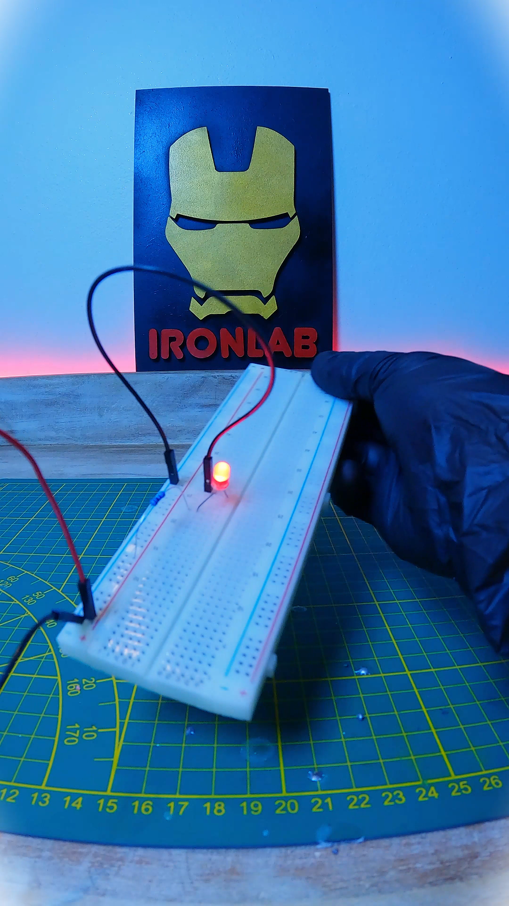

# Alimentation 5V 3A pour Projets Arduino

Ce guide pas à pas vous montre comment transformer une alimentation 5V 3A (type alimentation USB, LED ou autres) en une source d'alimentation stable pour vos projets Arduino, ESP32, servomoteurs, modules, etc., sur une breadboard.

---

## ⚠️ Avertissement

> Attention : cette opération implique une manipulation de fils électriques. Assurez-vous que l’alimentation est débranchée pendant les découpes et soudures.

---

## 🔧 Matériel nécessaire

- 1 alimentation 5V 3A (USB, LED, etc.)
- 1 connecteur mâle Dupont (ou embout pin header)
- 1 pince coupante / cutter
- Fer à souder + étain
- Gaine thermorétractable ou ruban isolant
- Multimètre (optionnel mais recommandé)

---

## 📸 Étapes illustrées

### 1. Identifier le câble d'alimentation

> Exemple : fil rouge = +5V, fil noir = GND  
> Utilisez un multimètre si les couleurs ne sont pas standardisées.

---

### 2. Couper la fiche d'origine

> Coupez proprement la fiche de sortie inutile (type jack ou USB).  
> Laissez suffisamment de longueur de câble pour souder.

---

### 3. Dénuder les fils

> Retirez environ 5 mm d'isolant sur chaque fil avec une pince ou un cutter.

---

### 4. Souder les pins mâles

> Soudez chaque fil sur un connecteur mâle :
> N'hésitez pas à utiliser du flux de soudure si vous en avez à disposition.

- Le +5V (souvent rouge) sur une pin
- Le GND (souvent noir) sur une autre

---

### 5. Isoler les connexions

> Isolez chaque pin avec de la gaine thermorétractable ou du ruban isolant pour éviter les courts-circuits.

---

### 6. Tester la tension

> Branchez l’alimentation et vérifiez avec un multimètre que vous avez bien du +5V entre les deux pins.

---

## ✅ Résultat final

> Vous avez maintenant une alimentation 5V fiable prête à être insérée sur une breadboard ou dans un projet Arduino.

---

## 🧪 Applications

- Projets Arduino Uno / Nano / ESP32
- Modules HC-SR04, DHT22, Servos
- Circuits LED
- Tout projet nécessitant une source 5V stable jusqu'à 3A

---

## ✍️ Nos projets

IronLab — Passionné d'électronique, robotique & projets DIY  

[YouTube](https://youtube.com/@ironlab_974) | [TikTok](https://www.tiktok.com/@ironlab_974) | [Instagram](https://www.instagram.com/ironlab_974)

AquaLab — La téchnologie au service du monde marin & chasse au trésor.

[YouTube](https://youtube.com/@aqualab_974) | [TikTok](https://www.tiktok.com/@aqualab_974) | [Instagram](https://www.instagram.com/aqualab_974)

Corail Création — Notre boutique

[TikTok](https://www.tiktok.com/@corail.creation) | [Instagram](https://www.instagram.com/corail.creation) | [Site marchand](https://www.corail-creation.re)

---

## 📄 Licence

Ce projet est open-source, sous licence MIT.  
N'hésitez pas à le modifier, le partager ou y contribuer.